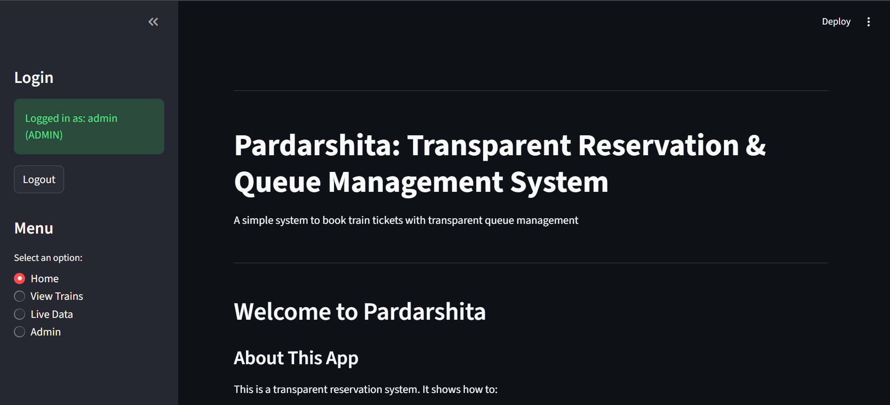
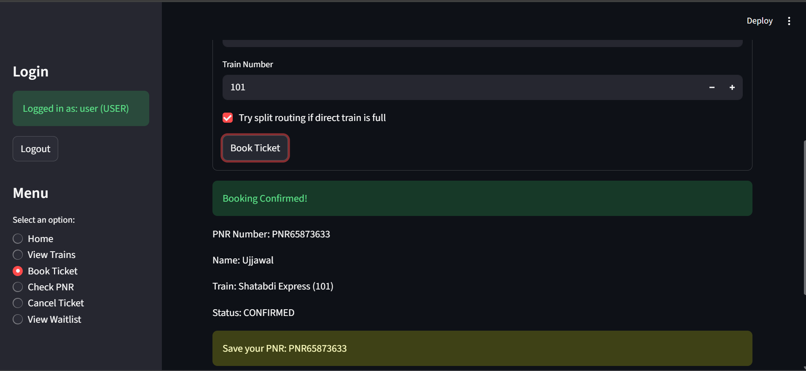
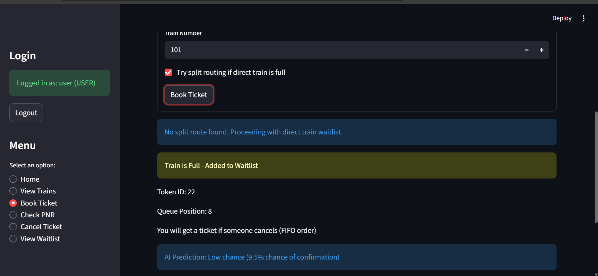
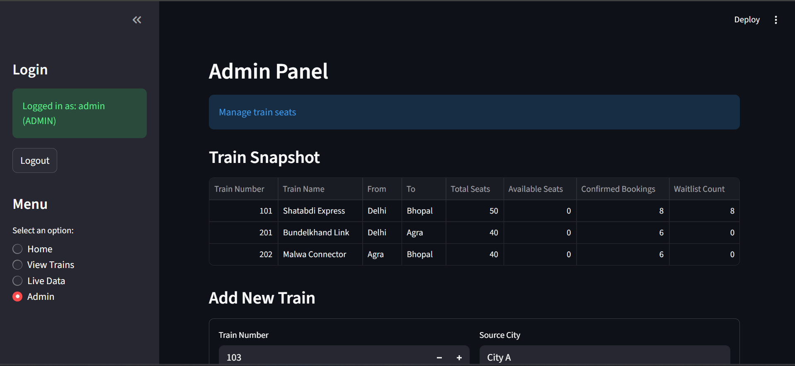

# Pardarshita — Train Ticket Booking & Queue Management System

A full-stack web application built with Python and Streamlit that simulates a railway reservation system. It demonstrates real-world concepts like relational databases, FIFO queue logic, role-based login, and a machine learning model that predicts your waitlist confirmation chances.

---

## What Does This Project Do?

When a train has available seats, users can book a ticket and get a PNR number instantly. When the train is full, they are added to a **waitlist queue** — and the system uses a **Logistic Regression model** to predict their probability of getting a confirmed seat. If a passenger cancels, the first person in the waitlist queue is automatically promoted to a confirmed booking (FIFO — First In, First Out).

An admin panel lets authorized users manage trains, view live seat data, and reset seat counts.

---

## Screenshots


| Page | Screenshot |
|------|-----------|
| Home / Login | |
| Book Ticket |  |
| Waitlist Prediction |  |
| Admin Panel |  |

---

## Features

- **Book Tickets** — Enter your name and train number; get a PNR number if seats are available
- **FIFO Waitlist** — If the train is full, you join a fair queue; cancellations auto-promote the next person
- **AI Waitlist Prediction** — Logistic Regression (with a heuristic fallback) estimates your confirmation probability
- **PNR Status Check** — Look up any booking by PNR to see its current status
- **Cancel Ticket** — Cancel a booking; freed seat goes to the first waitlist passenger automatically
- **Split Route Booking** — If your direct train is full, the app suggests two-leg journeys via a transfer city
- **Role-Based Login** — Separate views for `admin` and `user` roles; passwords stored as SHA-256 hashes
- **Admin Panel** — Add/delete trains, adjust seat counts, view live booking + waitlist data, review ML prediction history

---

## Tech Stack

| Layer | Technology |
|-------|-----------|
| Frontend / UI | [Streamlit](https://streamlit.io/) |
| Database | SQLite (via Python's built-in `sqlite3`) |
| Data Manipulation | Pandas |
| Machine Learning | scikit-learn — Logistic Regression |
| Auth / Security | SHA-256 password hashing (`hashlib`) |
| Language | Python 3 |

---

## How to Run Locally

### 1. Prerequisites

Make sure you have Python 3.8 or higher installed. You can check by running:

```bash
python --version
```

### 2. Install Dependencies

```bash
pip install streamlit pandas scikit-learn
```

### 3. Run the App

```bash
streamlit run project.py
```

The app will open in your browser at `http://localhost:8501`.

### 4. Login

Use these built-in demo accounts to explore the app:

| Role | Username | Password | Access |
|------|----------|----------|--------|
| Admin | `admin` | `admin123` | Full access — manage trains, view live data |
| User | `user` | `user123` | Book tickets, check PNR, cancel, view waitlist |

> The SQLite database file (`railway.db`) is created automatically on first launch. You can delete it to reset the app to a fresh state.

---

## How It Works — Key Concepts

### Database Design (SQLite)
The app uses five tables: `trains`, `bookings`, `waitlist`, `users`, and `waitlist_predictions`. Foreign key constraints enforce data integrity, and all multi-step operations (book + update seats, cancel + promote from waitlist) run inside a single transaction so the database never ends up in a broken state.

### FIFO Queue (Waitlist Logic)
The waitlist table uses an auto-incrementing `token_id`. When a seat opens up (via cancellation), the passenger with the **lowest token_id** on that train is always picked first — this is the FIFO (First In, First Out) guarantee.

### ML Prediction (Logistic Regression)
Every time a passenger joins the waitlist, the app records features like queue position, total seats, and seats available at the time of booking. Once enough historical data exists (12+ resolved records with both confirmed and not-confirmed outcomes), a Logistic Regression model trains on this data and predicts the probability. Before that threshold is reached, a heuristic formula is used as a fallback.

### Split Route Search (SQL Self-Join)
If your source → destination train is full, the app queries for two trains where `train1.destination = train2.source` using a SQL self-join, showing you transfer options where both legs have available seats.

### Role-Based Access Control
Passwords are never stored in plain text — they are hashed with SHA-256 before saving. On login, the entered password is hashed and compared against the stored hash. Admin and user roles are enforced both at the database level (via a `CHECK` constraint) and in the UI (role-based sidebar menus).

---

## Project Structure

```
project.py          # All application code (backend + UI in one file)
railway.db          # SQLite database (auto-created on first run)
README.md           # This file
```

---

## Demo Trains Available

| Train No. | Train Name | Route |
|-----------|-----------|-------|
| 101 | Shatabdi Express | Delhi → Bhopal (starts nearly full — good for testing waitlist) |
| 102 | Rajdhani Express | Mumbai → Kolkata |
| 201 | Bundelkhand Link | Delhi → Agra (split route leg 1) |
| 202 | Malwa Connector | Agra → Bhopal (split route leg 2) |

> **Try this:** Book multiple tickets on Train 101 until it fills up, then book one more to see the waitlist and AI prediction in action. Cancel an earlier booking to watch the automatic promotion.
